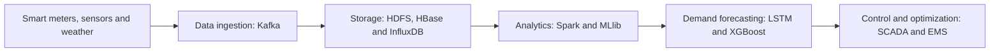

<div align="center">

# Smart Energy Grids & Sustainability

### Data-Driven Power Distribution Optimization

An interactive learning website exploring how grid data, forecasting and adaptive control can support a more sustainable electricity network.

**Y Eswar** · M.Tech Data Science (2025–2027)  
**GITAM University, Hyderabad** · Big Data Analytics · Topic 9


[Quick start](#quick-start) · [Features](#features) · [How it works](#how-it-works) · [Customize](#customize) · [Deploy](#deploy)


</div>

## Quick start

Install **Node.js 18 or later**, then run these commands from the repository root:

```bash
npm run dev
```

Open **http://127.0.0.1:4173/** in your browser. No `npm install`, API key or database setup is required.

<details>
<summary><strong>Commands and alternative ports</strong></summary>

| Command | Purpose |
| --- | --- |
| `npm run dev` | Start the local website server. |
| `npm start` | Start the same local server. |
| `npm run check` | Check the application JavaScript syntax. |
| `npm run build` | Run syntax checks. The deployable site is already in `dist/`. |
| `PORT=4200 npm run dev` | Use another port on macOS or Linux. |

For PowerShell:

```powershell
$env:PORT = 4200
npm run dev
```

Serve the site over HTTP. Opening `index.html` directly as a file can block JavaScript modules in the browser.

</details>

## Features

| Experience | What visitors can do |
| --- | --- |
| Cinematic project story | Explore alternating dark and light chapters, oversized typography and original grid imagery. |
| Interactive architecture | Switch between **Data pipeline** and **Adaptive control**, then select components to reveal their roles and connections. |
| Everyday learning examples | Explore evening demand, changing solar output, an equipment warning and an unusual meter reading. |
| Energy-balance simulation | Adjust demand, renewable availability and demand shifting to see the resulting balance change. |
| Technical explanations | Expand details about tools, methods, limitations and future research. |
| Responsive accessibility | Use keyboard controls, visible focus states, a mobile menu and reduced-motion support. |

<details>
<summary><strong>Explore the four everyday scenarios</strong></summary>

| Scenario | Learning takeaway |
| --- | --- |
| Evening demand | Forecasting anticipates peaks. Demand response moves flexible consumption to another time. |
| A cloudy afternoon | Renewable generation varies. Forecasting and storage have different roles in balancing supply. |
| Equipment warning | Anomaly detection begins a response. Engineers still need to establish the cause and act safely. |
| An unusual reading | A flagged pattern needs investigation. It is not proof of theft, and false alarms and privacy matter. |

These are illustrative everyday situations, not claims of completed project installations.

</details>

## How it works

The proposed data pipeline connects observations to distribution decisions:



The alternative adaptive-control concept groups the work into **collecting data**, **forecasting with LSTM + Transformer**, and **proposed reinforcement-learning control**. The website explains these concepts without connecting to a real grid or running trained models.

<details>
<summary><strong>Understand the simulation</strong></summary>

The demonstration represents **one imagined hour** and uses synthetic values.

```text
Adjusted demand = demand × (1 − shift / 100)
Renewable power used = min(renewable availability, adjusted demand)
Conventional supply = max(adjusted demand − renewable availability, 0)
Unused renewable availability = max(renewable availability − adjusted demand, 0)
Deferred energy = shifted power × 1 hour
```

At the default settings:

| Input or output | Value |
| --- | --- |
| Demand | 100 MW |
| Renewable availability | 60 MW |
| Demand shifted | 10% |
| Adjusted demand | 90 MW |
| Conventional supply needed | 30 MW |
| Energy deferred from this hour | 10 MWh |

Assumptions: lossless instantaneous balancing, no battery model, no network constraints and no trained forecast model. Deferred energy still needs to be served later.

</details>

## Project structure

```text
.
├── README.md
├── .gitignore
├── package.json
├── dist/                       # Editable and deployable website
│   ├── index.html              # Page narrative and semantic sections
│   ├── style.css               # Design, responsive layouts and motion
│   ├── app.js                  # UI interactions and simulation
│   ├── content.js              # Architecture and use-case content
│   └── assets/                 # Optimized responsive WebP images + favicon
├── scripts/
│   └── serve.mjs               # Local HTTP server
├── generated-assets/           # Original generated PNG images
├── source-presentations/       # Four original PPTX files
└── research/                   # Content extraction, audit and verification
```

Only `dist/` needs to be published as the website. The original presentations and research documentation remain available in the repository and are not linked from the public application.

## Customize

| Change | File |
| --- | --- |
| Headlines and page copy | [dist/index.html](dist/index.html) |
| Colors, spacing, layout or animations | [dist/style.css](dist/style.css) |
| Architecture descriptions or learning examples | [dist/content.js](dist/content.js) |
| Simulation logic or other interactions | [dist/app.js](dist/app.js) |
| Local server port or behavior | [scripts/serve.mjs](scripts/serve.mjs) |

To replace a visual, update the corresponding files in `dist/assets/`. Preserve a mobile hero crop and smaller below-the-fold image versions. Keep important text in HTML, rather than inside images.

## Verification

The website was checked at desktop **1440 × 900**, tablet **768 × 1024**, mobile **390 × 844**, and narrow mobile **320 × 740** sizes.

- All four use-case controls update their explanations.
- Both architecture views and component selections work.
- Simulation boundary values and reset behavior were checked.
- Mobile navigation and section links work.
- Responsive images load and no horizontal overflow was observed.
- No browser console errors or warnings were observed.
- JavaScript syntax checks pass.

See [the verification record](research/verification.md) for details. These are recorded checks, not an automatically updated CI status.

<details>
<summary><strong>Check your changes before publishing</strong></summary>

```bash
npm run check
npm run dev
```

Test both architecture views, every use case, all simulation sliders and reset, expandable explanations, mobile navigation and keyboard focus. Inspect desktop and mobile layouts, image loading and reduced-motion behavior.

</details>

## Deploy

This is a static website. Publish the **contents of `dist/`** through your static hosting provider, with `index.html` as the default document.

| Setting | Value |
| --- | --- |
| Install command | None required |
| Build command | None required; `npm run check` is an optional validation step |
| Public / publish directory | `dist` |
| Backend or environment secrets | None |

Preserve `assets/`, `style.css`, `app.js` and `content.js`. Relative URLs support hosting under a repository subpath. The local Node server is for previewing the website; it is not required by a static host.

## Push to GitHub

Create an empty GitHub repository, then run these commands from this project's root. Replace the placeholder remote URL with the URL of your repository:

```bash
git init
git add .
git commit -m "Add Smart Energy Grids learning website"
git branch -M main
git remote add origin https://github.com/YOUR_USERNAME/YOUR_REPOSITORY.git
git push -u origin main
```

If the project is already in a Git repository, use its existing remote and branch instead of initializing it again. Upload the extracted project files so `README.md`, `package.json` and `dist/` sit at the repository root.

## Content and project status

The project content comes from the four supplied presentations. The site focuses on learning, proposed functionality and future research, rather than presenting a validated grid deployment. The source material contains conflicting outcome claims without underlying evaluation records, so the public site does not present disputed numbers as verified achievements.

The source review is preserved in [research/content-audit.md](research/content-audit.md). All three cinematic images are original AI-generated illustrations. Names and affiliation are reproduced from the supplied work.

---

**About this README:** GitHub renders the badges, Mermaid diagram, section links and expandable explanations. JavaScript applications cannot run inside a GitHub README; the interactive experience runs in the website itself.
